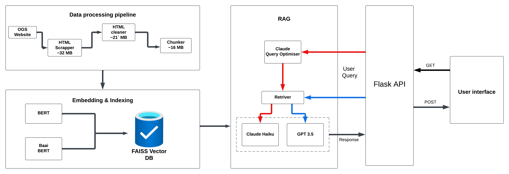
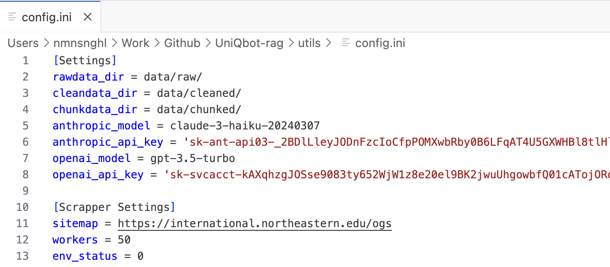

# PAWSISTANT
> RAG Chatbot for Northeastern University

[](https://www.youtube.com/watch?v=VJuLMpn4fjg)


## Table of Contents
* [Overview](#overview)
* [Features](#features)
* [Architecture](#architecture)
* [Installation](#installation)
  * Prerequisites
  * Setup Instructions
  * Usage
    * Configuration
    * How to Run?
* [Troubleshooting](#Troubleshooting)
* [License](#license)

# Overview
Pawsistant is an AI-powered chatbot enhancing document Q&A capabilities for Northeastern University's Office of Global Services (OGS). Using Retrieval-Augmented Generation (RAG), it provides instant, reliable answers to international student queries, reducing dependency on limited office hours and improving accessibility to vital services.

The system addresses challenges in accessing timely information by integrating web scraping, sophisticated preprocessing, and advanced language models to deliver accurate, contextually-aware responses about immigration procedures, visa guidelines, and university policies.

# Features
- 💬 Natural language understanding for human-like conversations
- 🔍 Advanced retrieval system using LlamaIndex and FAISS for scalable vector search
- 📚 Knowledge base with optimized HTML structure for better context comprehension
- 🔄 Automated website scraping pipeline that can be scheduled and customized
- 🤖 Support for both Claude and GPT language models with configurable parameters
- ⚙️ Highly configurable system with adjustable workers, chunking strategies, and data paths
- 🌐 User-friendly CLI and web interfaces for flexible deployment

# Architecture


# Installation
## Prerequisites
- **Python 3.6 or higher**
  - Download and install from [python.org](https://www.python.org/downloads/)
  - Verify installation with `python3 --version` in your terminal

- **Git** (recommended for cloning)
  - Windows: Download from [git-scm.com](https://git-scm.com/download/win)
  - macOS: Install with [Homebrew](https://brew.sh) using `brew install git` or download from [git-scm.com](https://git-scm.com/download/mac)
  - Linux: Use your distribution's package manager (e.g., `apt install git` or `yum install git`)

- **Repository access**
  - Option 1: Clone with Git
  - Option 2: Download as ZIP
 
- **API Access**
  - Claude API key for Claude model usage, OpenAI API key for ChatGPT.
  - Note: Web server needs both; CLI needs only the key for your chosen model.

## Setup Instructions
Check if Python is installed and verify version
```bash
python3 --version
```

Create a virtual environment with any name (eg. venv or .venv)
```bash
python3 -m venv <ENV_NAME>
```

Activate the virtual environment
```bash
source venv/bin/activate  # On macOS/Linux
```
```bash
.\venv\Scripts\activate   # On Windows
```

Install required dependencies from requirements.txt
```bash
pip install -r requirements.txt
```

## Usage

Before running the application, you need to set up a configuration file.

### Location
The configuration file should be located at `utils/config.ini`

<!--  -->

### Configuration Parameters

| **Parameter** | **Description**                                                     |
|-----------|---------------------------------------------------------------------|
| **rawdata_dir** | Directory where raw scraped data is stored                          |
| **cleandata_dir** | Directory where cleaned and processed data is saved                 |
| **chunkdata_dir** | Directory for storing text chunks used by the RAG system            |
| **anthropic_model** | The Claude model version to use (e.g., claude-3-haiku-20240307)     |
| **anthropic_api_key** | Your Anthropic API key for Claude models                            |
| **openai_model** | The OpenAI model version to use (e.g., gpt-3.5-turbo)               |
| **openai_api_key** | Your OpenAI API key for GPT models                                  |
| **sitemap** | URL of the website to scrape (starting point for the data pipeline) |
| **workers** | Number of concurrent workers for the scraping process               |
| **env_status** | Environment flag (default `0`)                                        |


### How to Run?
After setting up the configuration and activating your virtual environment, you can run the system in various modes as described below:
### Pipeline mode
This mode rebuilds the knowledge base by scraping data, cleaning it, and preparing it for the RAG system:
```bash
python app.py --pipeline
```
### Start Chatbot
> Note: The first-time initialization process requires approximately 10-20 minutes to complete, as the system builds embeddings and constructs the Vector Store. Completion time varies based on your available GPU resources and compute capacity.
### On Command Line Interface
The system works with both Claude and OpenAI GPT
```bash
python app.py --chatbot claude
```
```bash
python app.py --chatbot gpt
```

#### As a Web Service
```bash
python app.py --server
```
Once the server starts the web interface will be available at `http://127.0.0.1:5000/` in your browser.

# Troubleshooting
1. **API Key Errors** 

```
Error: Invalid API key: sk-ant-***
```
**Solution** - Verify your API keys in `utils/config.ini` are correct and not expired.

2. **Empty Responses** 

```
No relevant information found for query: [your query]
```
**Solution** - Try running the pipeline again to refresh the knowledge base, or make your query more specific.

3. **Web Scraping Errors**
```
Error 403: Forbidden
Error 404: Page Not Found
```
**Solution** - Check that the website allows scraping and that the URLs in your sitemap are valid. Consider adding delays between requests or implementing a user-agent rotation to avoid being blocked. Note that web scrapers often become outdated over time as websites change their structure or security measures. If you encounter persistent errors, you may need to update your scraper's browser headers, user agents, or request patterns to match current web standards.

4. **Port 5000 Already in Use**
```
ERROR: Address already in use
ERROR: The address is already in use, please try another port.
```
**Solution** - Identify and close the application using port 5000:
- On Mac/Linux: Run `lsof -i :5000` to find the process ID, then `kill <PID>` to terminate it.
- On Windows: Use Task Manager to identify and end the process using port `5000`.
- Alternatively, you can modify your application to use a different port if available.


# License

This project is proprietary. All rights reserved. This project may not be copied, modified, or distributed. Only the original creator has the right to maintain and modify this codebase.
